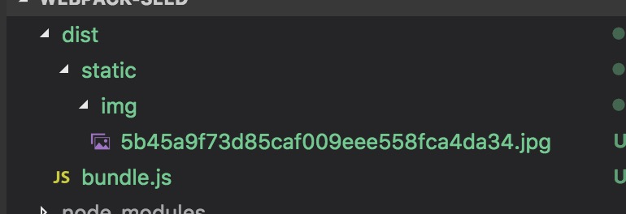

# 遇到的疑惑及记忆点
## 1.path.resolve与path.join与__dirname有什么区别？
### __dirname
就是获取当前项目所在电脑中的目录
### path.resolve
path.resolve的作用是——可以将多个路径解析为一个规范化的绝对路径 也就是对路径进行逐一cd操作，并且过程中不会校验路径是否存在，只是单纯的路径字符串操作

>eg：path.resolve('foo/bar', '/tmp/file/', '..', 'a/../subfile')  
>相当于  
>cd foo/bar  
>cd /tmp/file/  
>cd ..  
>cd a/../subfile  
>pwd

```javascript
let myPath1 = path.resolve(__dirname,'/src/pages/alert'); 
let myPath2 = path.resolve(__dirname,'./src/pages/alert');
console.log(__dirname);    // /Users/xmly/LSN/webpack-seed        
console.log(myPath1);      // /src/pages/alert  
console.log(myPath2);      // /Users/xmly/LSN/webpack-seed/src/pages/alert
```

### path.join
path.join()可以连接任意多个路径字符串。要连接的多个路径可做为参数传入。并且在连接路径的同时也会对路径进行规范化,并且过程中不会校验路径是否存在，只是单纯的路径字符串操作
```javascript
let myPath1 = path.join(__dirname,'alert',"haha"); // /Users/xmly/LSN/webpack-seed/alert/haha
let myPath3 = path.join('./src/pages','alert',{}); // 会报错 Path must be a string. Received {}
```
## 2.entry 入口可以是单个字符串、或者一个数组但最好是object

```javascript
entry: './src/pages/index/index.js'  

entry: ['./src/pages/index/index.js','./src/pages/alert/index.js']

entry: {
        'index/index': './src/pages/index/index.js',
        'alert/index':'./src/pages/alert/index.js'
}
```

## 3.output 常用的几个参数
>path:表示生成文件的根目录，需要传入一个绝对路径,**path参数和后面的filename参数共同组成入口文件的完整路径。**  
>publicPath:用于生成css/js/图片/字体文件等资源的路径，既可以是相对路径，也可以是绝对路径(当你的html文件跟其它资源放在不同的域名下的时候，就应该用绝对路径了，这种情况非常多见于后端渲染模板的场景。)  
>filename:表示的是如何命名生成出来的入口文件  
>chunkFilename:与filename参数类似,定义生成文件的命名，只不过chunkFilename指定的是除入口文件外的chunk的命名。  

```javascript
 output: {
      path: buildDir, // var buildDir = path.resolve(__dirname, './build');
      publicPath: '../../../../build/',
      filename: '[name]/entry.js',    // [name]表示entry每一项中的key，用以批量指定生成后文件的名称
      chunkFilename: '[id].bundle.js',
    },
```
## 4.如果特别需要的话，可以结合extract-text-webpack-plugin 单独打包css/less/sass，避免所有的样式与js一起打包进一个bundle
## 5.使用webpack也可以打包图片、字体
使用url-loader时，limit参数表示图片超过一定字节就使用url-loader来处理，否则默认使用file-loader处理
```javasctipt

webpack中的配置
{
        // 图片加载器，雷同file-loader，更适合图片，可以将较小的图片转成base64，减少http请求
        // 如下配置，将小于8192byte的图片转成base64码
        test: /\.(png|jpg|gif)$/,
        loader: 'url-loader?limit=8192&name=./static/img/[hash].[ext]',
}
```
编译的结果如下  


## 6.使用CommonsChunkPlugin来避免重复打包

```javasctipt
//打包公共代码,避免重复打包,比如很多页面都引入一个共同的组件
new webpack.optimize.CommonsChunkPlugin({
    name: 'common', //公共抽离的js模块名称
    filename: '[name].bundle.js' , //生成后的文件名，虽说用了[name]，但实际上就是'common.bundle.js'了
    minChunks:2, //设定某个js模块被几个页面引用，才算是公共代码
})

```


注：webpack-bundle-analyzer wepback的可视化资源分析工具